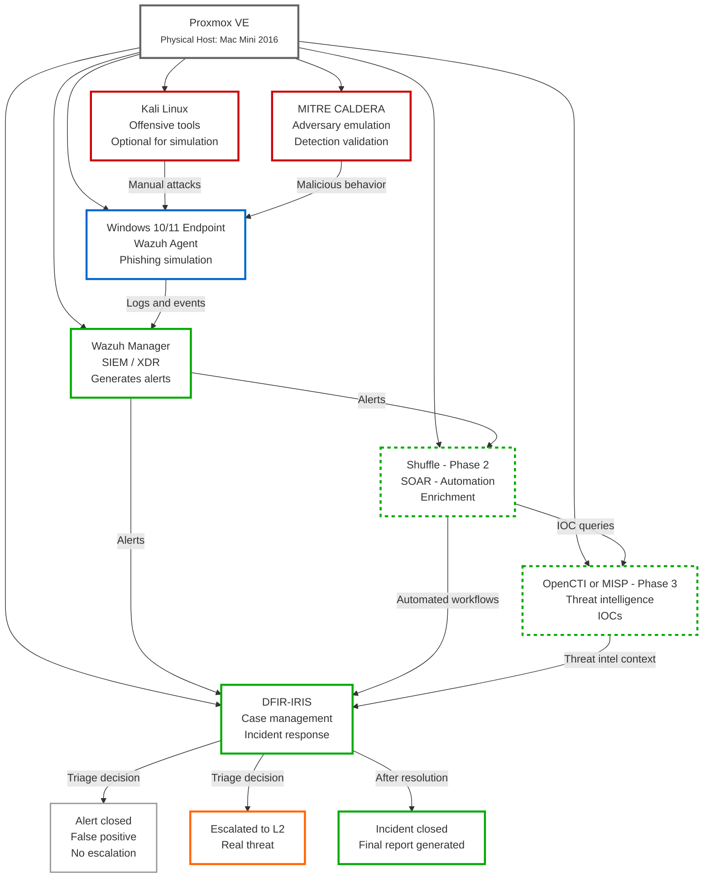
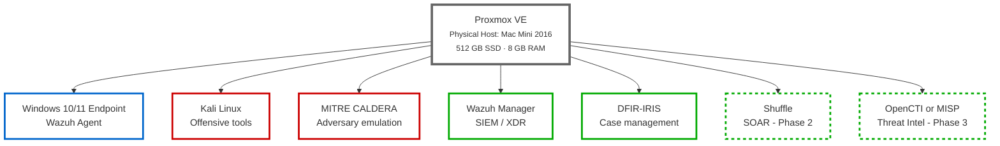
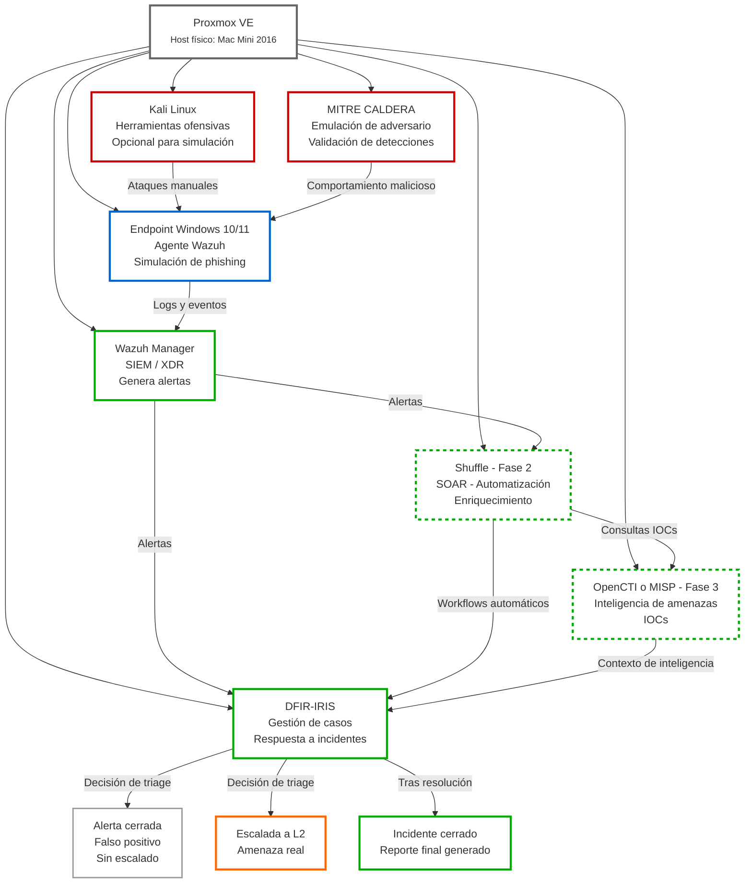

# hybrid-soc-lab

**Hybrid SOC Lab – Phishing + Incident Response (L1 Focus)**

[🇬🇧 English](#english) | [🇪🇸 Español](#español)

### Phishing incident sequence diagram

## 🇬🇧 English

### Hybrid SOC Lab – Phishing and Incident Response (L1 Focus)

### General architecture

I had an old 2016 Mac Mini, so I decided to use it as a lab environment.  
It has a 512 GB SSD and 8 GB of RAM, which is more than enough to start.  
As the project grows, I plan to adjust resources and gradually increase the complexity of the lab.

### Project overview
This repository documents the step-by-step creation of a small hybrid SOC laboratory using open-source tools.  
The main goal of this project is to learn how a Security Operations Center works from an entry-level (SOC L1) perspective, focusing on detection, alert analysis, and incident handling.  

Special attention is given to phishing-related scenarios, as they are one of the most common use cases in real SOC environments.

This is a learning project. It is not intended to simulate advanced attacks or red team activities, but rather to understand the daily workflow of a SOC analyst.

### What I want to learn with this lab
With this project, I aim to:

- Understand the basic structure and purpose of a SOC
- Learn how security alerts are generated and analyzed
- Practice incident handling and case management
- Get familiar with SIEM, incident response, and SOAR concepts
- Improve decision-making around alert triage and escalation
- Work with realistic phishing-related scenarios

### General architecture
The lab is built on top of Proxmox VE, which is used to host and isolate the different components using virtual machines.

### General architecture

#### Why Proxmox
Proxmox is used to:

- Simulate an on-premise corporate environment
- Separate SOC components into different systems
- Easily manage virtual machines and snapshots
- Keep the lab modular and easy to expand

### Main components

- **Proxmox VE**  
  Virtualization platform

- **Windows 10 / 11 endpoint**  
  Simulates a corporate user workstation  
  Wazuh agent installed  
  Used for phishing and suspicious activity scenarios

- **Wazuh**  
  SIEM / XDR platform  
  Centralizes logs and generates security alerts

- **MITRE CALDERA**  
  Used to simulate adversary behavior  
  Focused on detection validation, not exploitation

- **DFIR-IRIS**  
  Incident response and case management platform

### Advanced phase (optional)

- **Shuffle (SOAR)**  
  Used for simple automation and enrichment workflows

- **OpenCTI or MISP**  
  Used to add threat intelligence context

### Project approach
This lab is designed from the point of view of a SOC Level 1 analyst.  
Because of that:

- The focus is on analysis and process, not on complex attacks
- Tools are used at a basic and realistic level
- Decisions such as closing or escalating alerts are documented
- Simple playbooks and workflows are preferred

The value of this project is not technical complexity, but understanding the SOC workflow from start to finish.

### Project phases
The lab is built progressively, phase by phase.

**Phase 0 – Environment preparation**

- Proxmox installation and basic configuration
- Network setup
- Creation of base virtual machines

**Phase 0.5 – Endpoint and phishing scenarios**

- Deployment of a Windows endpoint
- Wazuh agent installation
- Simulation of phishing-related behavior
- Observation of logs and alerts generated by Wazuh

**Phase 1 – Incident management with DFIR-IRIS**

- DFIR-IRIS installation using Docker
- Creation and tracking of security cases
- Basic integration with Wazuh alerts
- Incident lifecycle documentation

**Phase 2 – Automation with Shuffle**

- Shuffle installation
- Simple workflows such as:  
  Wazuh alert → enrichment → case creation
- Focus on triage automation, not response actions

**Phase 3 – Threat intelligence context (optional)**

- Integration with OpenCTI or MISP
- IOC lookups for alert enrichment
- Supporting decision-making with additional context

### Documentation style
Each phase includes:

- What was configured
- What alerts were generated
- How a SOC L1 analyst would analyze them
- When an alert should be closed or escalated
- Example notes or ticket-style documentation

The goal is to think and work like a SOC analyst, not like an attacker.

### Project status
Work in progress.  
The lab is being built and documented gradually.

### Disclaimer
This project is for learning and educational purposes only.  
All simulations are performed in a controlled environment, at my house. If the Mac Mini explodes, we'll let you know here 😄

## 🇪🇸 Español

### Hybrid SOC Lab – Phishing e Incidentes de Seguridad (Enfoque L1)

### Arquitectura general

Tenía un Mac Mini de 2016 sin uso, así que decidí aprovecharlo como entorno de laboratorio.  
Cuenta con 512 GB de SSD y 8 GB de RAM, suficiente para empezar.  
A medida que el proyecto avance, iré ajustando recursos y aumentando poco a poco la complejidad del laboratorio.

### Descripción del proyecto
Este repositorio documenta la creación paso a paso de un laboratorio SOC híbrido utilizando herramientas open source.  
El objetivo principal es aprender cómo funciona un Security Operations Center desde la perspectiva de un analista SOC L1, centrándome en la detección, el análisis de alertas y la gestión de incidentes.  

Se da especial importancia a escenarios de phishing, ya que son uno de los casos más habituales en entornos SOC reales.

Es un proyecto formativo. No pretende simular ataques avanzados ni actividades de red team, sino entender el trabajo diario de un analista SOC.

### Qué quiero aprender con este laboratorio
Con este proyecto quiero:

- Entender la estructura y el propósito de un SOC
- Aprender cómo se generan y analizan alertas de seguridad
- Practicar la gestión de incidentes y casos
- Familiarizarme con conceptos de SIEM, respuesta a incidentes y SOAR
- Mejorar la toma de decisiones en el triage y escalado de alertas
- Trabajar con escenarios realistas relacionados con phishing

### Arquitectura general
El laboratorio se construye sobre Proxmox VE, que se utiliza para alojar y aislar los distintos componentes mediante máquinas virtuales.

#### Por qué Proxmox
Proxmox se utiliza para:

- Simular un entorno corporativo on-premise
- Separar los componentes del SOC en sistemas distintos
- Gestionar fácilmente máquinas virtuales y snapshots
- Mantener el laboratorio modular y escalable

### Componentes principales

- **Proxmox VE**  
  Plataforma de virtualización

- **Endpoint Windows 10 / 11**  
  Simula el puesto de trabajo de un usuario corporativo  
  Agente de Wazuh instalado  
  Usado para escenarios de phishing y actividad sospechosa

- **Wazuh**  
  Plataforma SIEM / XDR  
  Centraliza logs y genera alertas de seguridad

- **MITRE CALDERA**  
  Usado para simular comportamientos adversarios  
  Enfocado a validar detecciones, no a explotar sistemas

- **DFIR-IRIS**  
  Plataforma de gestión de incidentes y casos

### Fase avanzada (opcional)

- **Shuffle (SOAR)**  
  Usado para automatización y enriquecimiento básico

- **OpenCTI o MISP**  
  Añaden contexto de inteligencia de amenazas

### Enfoque del proyecto
Este laboratorio está diseñado desde el punto de vista de un analista SOC Nivel 1.  
Por ello:

- El foco está en el análisis y los procesos, no en ataques complejos
- Las herramientas se usan de forma básica y realista
- Se documentan decisiones como cerrar o escalar alertas
- Se priorizan playbooks y flujos sencillos

El valor del proyecto no está en la complejidad técnica, sino en entender el flujo completo de trabajo en un SOC.

### Fases del proyecto
El laboratorio se construye de forma progresiva.

**Fase 0 – Preparación del entorno**

- Instalación y configuración básica de Proxmox
- Configuración de red
- Creación de máquinas virtuales base

**Fase 0.5 – Endpoint y escenarios de phishing**

- Despliegue de un endpoint Windows
- Instalación del agente de Wazuh
- Simulación de comportamientos relacionados con phishing
- Observación de logs y alertas generadas por Wazuh

**Fase 1 – Gestión de incidentes con DFIR-IRIS**

- Instalación de DFIR-IRIS mediante Docker
- Creación y seguimiento de casos
- Integración básica con alertas de Wazuh
- Documentación del ciclo de vida del incidente

**Fase 2 – Automatización con Shuffle**

- Instalación de Shuffle
- Flujos simples como:  
  Alerta de Wazuh → enriquecimiento → creación de caso
- Enfoque en automatizar el triage, no la respuesta

**Fase 3 – Contexto de inteligencia (opcional)**

- Integración con OpenCTI o MISP
- Consultas de IOCs para enriquecer alertas
- Apoyo a la toma de decisiones

### Estilo de documentación
Cada fase incluye:

- Qué se ha configurado
- Qué alertas se han generado
- Cómo las analizaría un analista SOC L1
- Cuándo cerrar o escalar una alerta
- Ejemplos de notas o documentación tipo ticket

El objetivo es pensar y trabajar como un analista SOC, no como un atacante.

### Estado del proyecto
En desarrollo.  
El laboratorio se construye y documenta de forma progresiva.

### Aviso
Este proyecto es exclusivamente formativo.  
Todas las simulaciones se realizan en un entorno controlado, en mi casa, si explota el macmini avisaremos por aqui 😄 
