# hybrid-soc-lab

**Laboratorio SOC Híbrido: Phishing + Respuesta a Incidentes (Enfoque L1)**
**Enfoque:** SOC Nivel 1: Detección de Phishing y Triaje de Incidentes
**Qué busca este laboratorio:** Análisis de alertas, decisiones de triaje, criterios de escalamiento y documentación de incidentes.

[🇬🇧 English](#english) | [🇪🇸 Español](#español)

## 🇪🇸 Español

### Laboratorio Híbrido SOC – Phishing y Respuesta a Incidentes (Enfocado Nivel 1)
Tengo un Mac Mini 2016 viejo, así que he decidido usarlo como entorno de laboratorio.  
Tiene un SSD de 512 GB y 8 GB de RAM, que es más que suficiente para empezar.  
A medida que el proyecto crezca, planeo ajustar los recursos y aumentar gradualmente la complejidad del laboratorio.

### Resumen del proyecto
Este repositorio documenta la creación paso a paso de un pequeño laboratorio híbrido SOC utilizando herramientas de código abierto.  
El objetivo principal de este proyecto es aprender cómo funciona un Centro de Operaciones de Seguridad desde la perspectiva de nivel de entrada (SOC L1), enfocándose en la detección, análisis de alertas y manejo de incidentes.  

Se presta especial atención a escenarios relacionados con phishing, ya que son uno de los casos de uso más comunes en entornos SOC reales.

Este es un proyecto de aprendizaje. No pretende simular ataques avanzados o actividades de red team, sino más bien comprender el flujo de trabajo diario de un analista SOC.

### Lo que quiero aprender con este laboratorio
Con este proyecto, pretendo:
- Comprender la estructura básica y el propósito de un SOC
- Aprender cómo se generan y analizan las alertas de seguridad
- Practicar el manejo de incidentes y la gestión de casos
- Familiarizarme con los conceptos de SIEM, respuesta a incidentes y SOAR
- Mejorar la toma de decisiones en torno al triaje y escalado de alertas
- Trabajar con escenarios realistas relacionados con phishing

### Arquitectura general
El laboratorio está construido sobre Proxmox VE, que se utiliza para alojar y aislar los diferentes componentes mediante máquinas virtuales.

### Arquitectura general

```mermaid
graph TD
    P[Proxmox VE<br/><small>Host Físico: Mac Mini 2016</small>]

    W["Endpoint Windows 10/11<br>Agente Wazuh<br>Simulación de phishing"]
    K["Kali Linux<br>Herramientas simulación controlada<br>"]
    C["MITRE CALDERA<br>Emulación de adversarios<br>Validación de detección"]
    WAZ["Wazuh Manager<br>SIEM / XDR<br>Genera alertas"]
    IRIS["DFIR-IRIS<br>Gestión de casos<br>Respuesta a incidentes"]
    SH["Shuffle - Fase 2<br>SOAR - Automatización<br>Enriquecimiento"]
    TI["OpenCTI o MISP - Fase 3<br>Inteligencia de amenazas<br>IOCs"]

    CLOSED["Alerta cerrada<br>Falso positivo<br>Sin escalado"]
    ESCALATED["Escalado a L2<br>Amenaza real"]
    REPORT["Incidente cerrado<br>Reporte final generado"]

    P --> W
    P --> K
    P --> C
    P --> WAZ
    P --> IRIS
    P --> SH
    P --> TI

    W -->|Logs y eventos| WAZ
    K -->|Ataques manuales| W
    C -->|Comportamiento malicioso| W
    WAZ -->|Alertas| IRIS
    WAZ -->|Alertas| SH
    SH -->|Flujos automatizados| IRIS
    SH -->|Consultas IOC| TI
    TI -->|Contexto de inteligencia| IRIS

    IRIS -->|Decisión de triaje| CLOSED
    IRIS -->|Decisión de triaje| ESCALATED
    IRIS -->|Tras resolución| REPORT

    style P stroke:#666,stroke-width:3px,fill:none
    style W stroke:#0066cc,stroke-width:3px,fill:none
    style K stroke:#cc0000,stroke-width:3px,fill:none
    style C stroke:#cc0000,stroke-width:3px,fill:none
    style WAZ stroke:#00aa00,stroke-width:3px,fill:none
    style IRIS stroke:#00aa00,stroke-width:3px,fill:none
    style SH stroke:#00aa00,stroke-width:3px,stroke-dasharray: 5 5,fill:none
    style TI stroke:#00aa00,stroke-width:3px,stroke-dasharray: 5 5,fill:none
    style CLOSED stroke:#999,stroke-width:2px,fill:none
    style ESCALATED stroke:#ff6600,stroke-width:3px,fill:none
    style REPORT stroke:#00aa00,stroke-width:3px,fill:none

```

#### Por qué Proxmox como entorno virtual
Proxmox se utiliza para:
- Simular un entorno corporativo on-premise
- Separar los componentes del SOC en diferentes sistemas
- Gestionar fácilmente máquinas virtuales y snapshots
- Mantener el laboratorio modular y fácil de expandir

### Enfoque del proyecto
Este laboratorio está diseñado desde el punto de vista de un analista SOC Nivel 1.  
Por eso:

- El enfoque está en el análisis y el proceso, no en ataques complejos
- Las herramientas se utilizan a un nivel básico y realista
- Las decisiones como cerrar o escalar alertas se documentan
- Se prefieren playbooks y flujos de trabajo simples

El valor de este proyecto no es la complejidad técnica, sino comprender el flujo de trabajo del SOC de principio a fin.

### Fases del proyecto
El laboratorio se construye progresivamente, fase por fase.

**Fase 1** ✅ Completado
**Preparación del entorno PROXMOX como plataforma de virtualización** 
- Instalación y configuración básica de Proxmox
- Configuración de red
- Creación de máquinas virtuales base

**Fase 2** ✅ Completado 
**Wazuh** 
- Para la observación de logs y alertas generadas por Wazuh
- Plataforma SIEM / XDR  
- Centraliza logs y genera alertas de seguridad

**Fase 3** 🟡 In progreso
**Windows como Endpoint**  
- Implementación de un endpoint Windows
- Simulación de comportamiento relacionado con phishing
- Instalación del agente Wazuh
- Simula una estación de trabajo de usuario corporativo  
- Agente Wazuh instalado para empezar a   
- Se utiliza para escenarios de phishing y actividad sospechosa

**Fase 4**
**Kali**
- Configuracion de Kali Linux
- Se utiliza únicamente para simulación controlada y validación de detección.

**Fase 5**
**Mitre Caldera**
- Configuración de Caldera
- Se utiliza para simular el comportamiento de adversarios  
- Enfocado en la validación de detecciones, no en la explotación

**OPCIONAL / PLANIFICADO**
- Instalación de DFIR-IRIS usando Docker
- Creación y seguimiento de casos de seguridad
- Integración básica con alertas de Wazuh
- Documentación del ciclo de vida del incidente
- Automatización con Shuffle
- Instalación de Shuffle
- Flujos de trabajo simples como:  
  Alerta de Wazuh → enriquecimiento → creación de caso
- Enfoque en la automatización del triaje, no en acciones de respuesta

**OPCIONAL / FUTURO**
- Integración con OpenCTI o MISP
- Búsquedas de IOCs para enriquecimiento de alertas
- Apoyo a la toma de decisiones con contexto adicional

### El comienzo
Una vez instalado el sistema básico de Wazuh + endpoint + Kali, podemos comenzar a hacer las primeras pruebas y asegurarnos de que todo funcione, luego instalaremos Caldera.

Cada fase incluye:
- Lo que se configuró
- Qué problemas se generaron

El objetivo es pensar y trabajar como un **analista SOC**, no como un atacante.
- Cómo los analizaría un analista SOC L1
- Cuándo una alerta debería cerrarse o escalarse
- Notas de ejemplo o documentación estilo ticket

### Estado del proyecto
Trabajo en progreso.  
El laboratorio se está construyendo y documentando gradualmente.

### Descargo de responsabilidad
Este proyecto es solo para fines de aprendizaje y educación.  
Todas las simulaciones se realizan en un entorno controlado, en mi casa. Si el Mac Mini explota, lo informaremos aquí 😄

## 🇬🇧 English

# hybrid-soc-lab

**Hybrid SOC Lab: Phishing + Incident Response (L1 Focus)**
**Focus:** SOC Level 1: Phishing Detection and Incident Triage
**What this lab seeks:** Alert analysis, triage decisions, escalation criteria, and incident documentation.

## English Version

### Hybrid SOC Lab – Phishing and Incident Response (L1 Focus)
I have an old 2016 Mac Mini, so I've decided to use it as a lab environment.  
It has a 512 GB SSD and 8 GB of RAM, which is more than enough to get started.  
As the project grows, I plan to adjust resources and gradually increase the lab's complexity.

### Project Overview
This repository documents the step-by-step creation of a small hybrid SOC lab using open-source tools.  
The main goal of this project is to learn how a Security Operations Center works from an entry-level (SOC L1) perspective, focusing on detection, alert analysis, and incident handling.  

Special attention is given to phishing-related scenarios, as they are one of the most common use cases in real SOC environments.

This is a learning project. It is not intended to simulate advanced attacks or red team activities, but rather to understand the daily workflow of a SOC analyst.

### What I Want to Learn with This Lab
With this project, I aim to:
- Understand the basic structure and purpose of a SOC
- Learn how security alerts are generated and analyzed
- Practice incident handling and case management
- Get familiar with SIEM, incident response, and SOAR concepts
- Improve decision-making around alert triage and escalation
- Work with realistic phishing-related scenarios

### General Architecture
The lab is built on top of Proxmox VE, which is used to host and isolate the different components using virtual machines.

### General Architecture

#### Why Proxmox as the Virtual Environment
Proxmox is used to:
- Simulate an on-premise corporate environment
- Separate SOC components into different systems
- Easily manage virtual machines and snapshots
- Keep the lab modular and easy to expand

### Project Approach
This lab is designed from the point of view of a SOC Level 1 analyst.  
Therefore:

- The focus is on analysis and process, not on complex attacks
- Tools are used at a basic and realistic level
- Decisions such as closing or escalating alerts are documented
- Simple playbooks and workflows are preferred

The value of this project is not technical complexity, but understanding the SOC workflow from start to finish.

### Project Phases
The lab is built progressively, phase by phase.

**Phase 1** ✅ Completed
**PROXMOX Environment Preparation as a Virtualization Platform** 
- Proxmox installation and basic configuration
- Network setup
- Creation of base virtual machines

**Phase 2** ✅ Completed  
**Wazuh** 
- For observing logs and alerts generated by Wazuh
- SIEM / XDR platform  
- Centralizes logs and generates security alerts

**Phase 3** 🟡 In progress
**Windows as Endpoint**  
- Deployment of a Windows endpoint
- Simulation of phishing-related behavior
- Installation of the Wazuh agent
- Simulates a corporate user workstation  
- Wazuh agent installed to begin monitoring  
- Used for phishing and suspicious activity scenarios

**Phase 4**
**Kali**
- Kali Linux configuration
- Used only for controlled simulation and detection validation.

**Phase 5**
**Mitre Caldera**
- Caldera configuration
- Used to simulate adversary behavior  
- Focused on detection validation, not exploitation

**OPTIONAL / PLANNED**
- DFIR-IRIS installation using Docker
- Creation and tracking of security cases
- Basic integration with Wazuh alerts
- Incident lifecycle documentation
- Automation with Shuffle
- Shuffle installation
- Simple workflows such as:  
  Wazuh alert → enrichment → case creation
- Focus on triage automation, not response actions

**OPTIONAL / FUTURE**
- Integration with OpenCTI or MISP
- IOC lookups for alert enrichment
- Supporting decision-making with additional context

### The Beginning
Once the basic Wazuh + endpoint + Kali system is installed, we can start doing the first tests and make sure everything is working, then we'll install Caldera.

Each phase includes:
- What was configured
- What problems were generated

The goal is to think and work like a **SOC analyst**, not like an attacker.
- How a SOC L1 analyst would analyze them
- When an alert should be closed or escalated
- Example notes or ticket-style documentation

### Project Status
Work in progress.  
The lab is being built and documented gradually.

### Disclaimer
This project is for learning and educational purposes only.  
All simulations are performed in a controlled environment, at my house. If the Mac Mini explodes, we'll let you know here 😄
